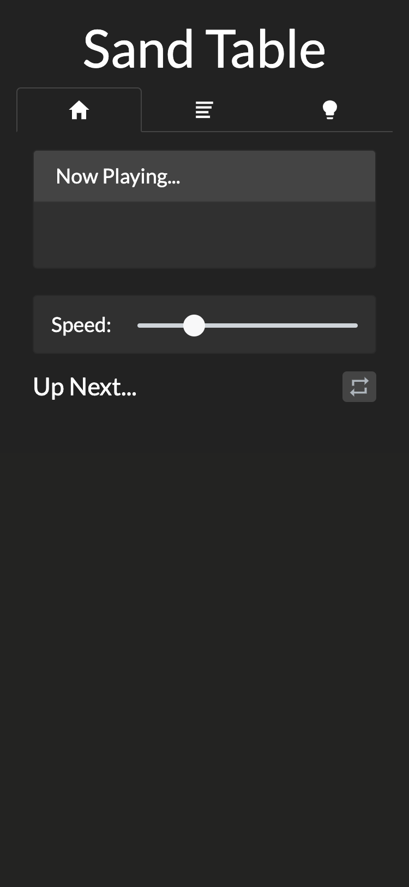
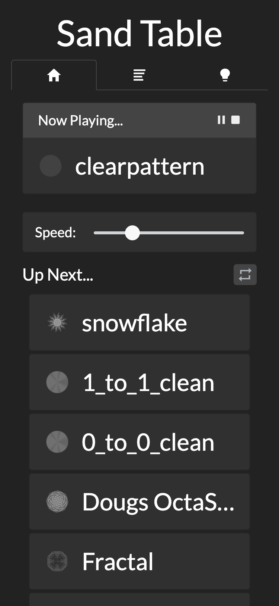
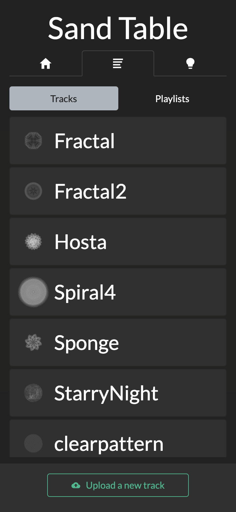
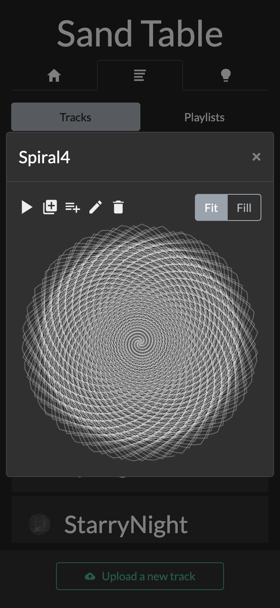
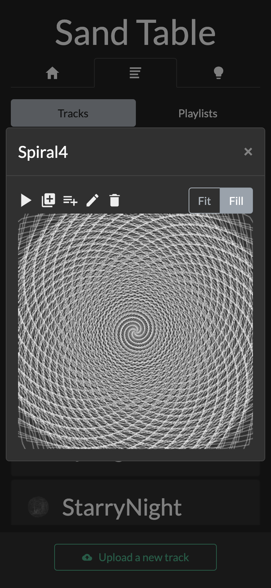
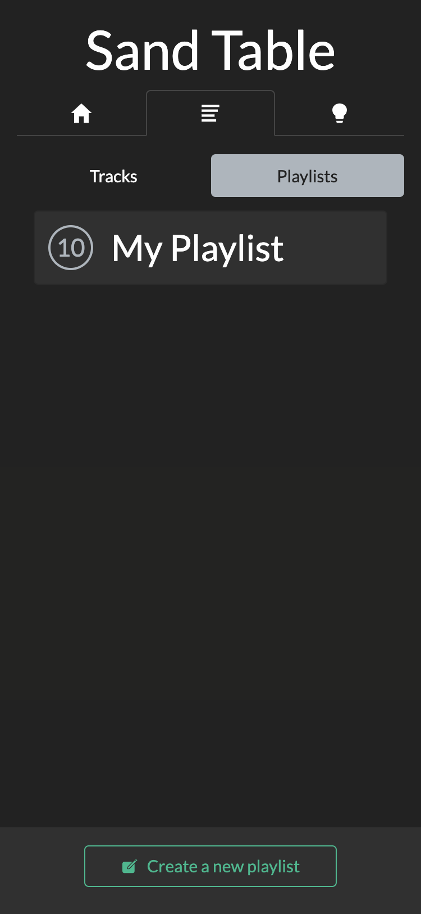
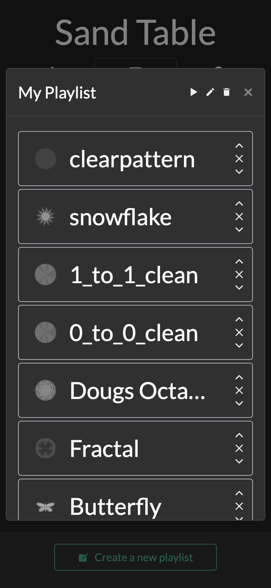
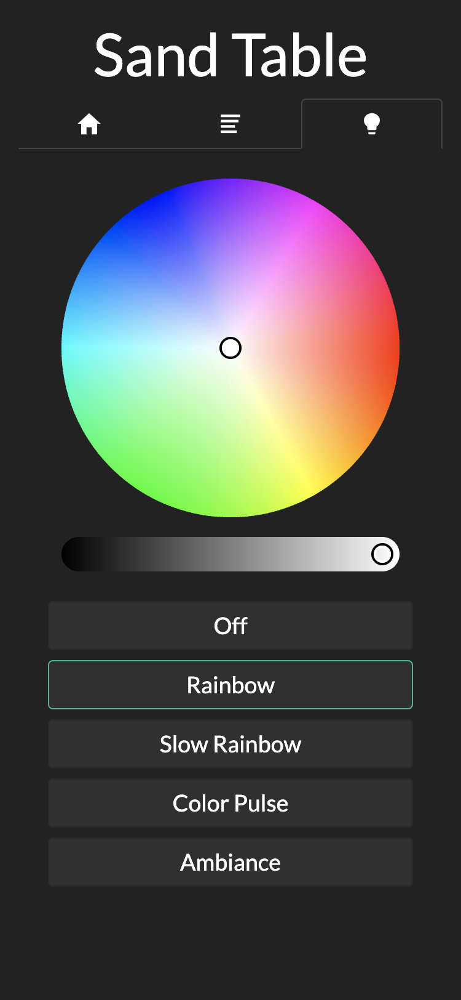
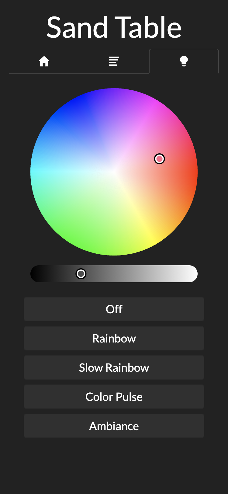

<h1>Webserver Mesa de arena kinetica</h1>
<h3>Un servidor web NodeJS con ReactJS y Bootstrap para controlar su mesa de arena de forma remota</h3>

Designed by Ravi Dudhagra ([@rdudhagra](https://github.com/rdudhagra))
Modificado y tradaducido por Diego Ruiz ([@druiz](https://github.com/Cyclonesoft/))

- [Instrucciones de Instalación](#installation-instructions)
  - [Prerequisitos](#prerequisites)
  - [Costrucción](#building)
  - [Ejecutar el Webserver](#running-the-webserver)
  - [Ejecutar el Webserver (development)](#running-the-webserver-development)
- [Descargar Patrones](#downloading-tracks)
- [Screenshots](#screenshots)

# Instrucciones de Instalación

## Prerequisitos
Este proyecto se desarrolló con lo siguiente:
- `NodeJS v13.11.0`
- `NPM v6.14.5`

## Costrucción
1. Descargue esta carpeta al directorio que prefieras
2. En el mismo directorio de `package.json`, ejecuta
   ```bash
   npm install # instala paquetes y dependencias
   ```
3. En el archivo `.env`, Edite los parámetros para que coincidan con su configuración.

## Ejecutar el Webserver
1. En el mismo directorio de `package.json`, ejecuta
   ```bash
   npm run prod # compila archivos de cliente y servidor en modo de producción y ejecuta el servidor
   ```
2. Visita `http://[ip de tu maquina]` en un navegador web (corre en el puerto 80)

Si desea ejecutar este servidor web a través de systemd, el script`start.sh` debería ayudar en esto, suponiendo que esté usando NVM para administrar las versiones de Node.

## Ejecutar el Weserver (development)
1. En el mismo directorio de `package.json`, ejecuta
   ```bash
   npm start # compila archivos del cliente, compila archivos del servidor en la memoria, inicia el servidor con nodemon (se reinicia al cambiar el archivo)
   ```
2. Visita `http://[ip de tu maquina]:3000` en un navegador web(corre en el puerto 3000)

# Descargar Patrones
Cualquier archivo`.thr` es compatible con la mesa Sisyphus funcionará con este software. Puede encontrar una colección de patrones disponibles públicamente en los siguientes enlaces:
- https://github.com/Dithermaster/sisyphus
- https://github.com/SlightlyLoony/JSisyphus
- https://github.com/heropup/sisyphus
- http://thejuggler.net/sisyphus/
- https://github.com/ddkengr/Sisyphus-threads

# Screenshots








